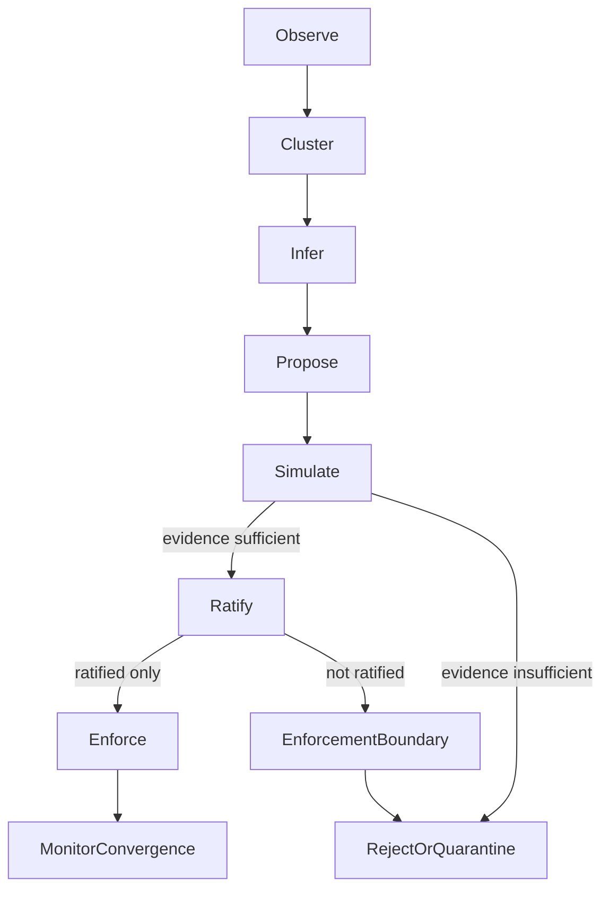

# AUTONOMOUS_CONSTRAINT_DISCOVERY_PROTOCOL.md

**Status:** Draft Architecture Brief  
**Scope:** Documentation-only protocol definition  
**Constraint:** No runtime code, no feature flags, no Phase 2 activation, no authority transfer

---

## 1. Definitions

**NFM (Non-Fungible Mistake)**  
A specific failure event with traceable context, where the error cannot be safely treated as interchangeable noise because it carries unique causal evidence relevant to governance.

**Delegation surface**  
The total set of actions, tools, lanes, repos, and handoff paths that can be reached through delegated execution.

**Reachable failure mode**  
A failure mode that is not only theoretically possible, but currently reachable through the active delegation surface and decision graph.

**Missing constraint**  
A governance gap where no ratified rule currently prevents, narrows, or detects a repeatedly observed reachable failure mode.

**Candidate constraint**  
A proposed rule intended to close a documented missing-constraint gap; it is non-binding until ratified.

**Ratified constraint**  
A candidate constraint approved through lattice ratification procedures and therefore authorized for enforcement.

**Enforcement boundary**  
The explicit line separating what can be observed, inferred, proposed, and simulated autonomously from what requires ratified constitutional authority before enforcement.

---

## 2. Protocol Flow

The lattice transitions from reactive containment to structured discovery through this pipeline:

1. **Observe**  
   Collect NFMs with lane context, repo scope, delegation path, and evidence references.
2. **Cluster**  
   Group NFMs by shared causal signature, not by superficial symptom overlap.
3. **Infer**  
   Identify likely missing constraints and map affected delegation surfaces.
4. **Propose**  
   Generate candidate constraints with explicit hypotheses and enforcement boundaries.
5. **Simulate**  
   Evaluate candidate constraints against historical and adversarial evidence without activating enforcement.
6. **Ratify**  
   Route candidates through lattice ratification; only this step can elevate authority.
7. **Enforce**  
   Apply only ratified constraints at designated enforcement points.
8. **Monitor convergence**  
   Track whether observed failures converge toward governance specification and whether reachable surfaces shrink as expected.

**Protocol invariant:**  
`observe -> cluster -> infer -> propose -> simulate` may be autonomous.  
Autonomous discovery stops at `SIMULATED`. `RATIFIED` requires external lattice authority. `ENFORCED` requires ratification proof plus a live enforcement entrypoint.

---

## 3. Safety Boundaries

### Allowed autonomously

- Autonomous discovery of repeated NFMs
- Autonomous clustering of NFM evidence
- Autonomous inference of missing-constraint hypotheses
- Autonomous proposal of candidate constraints
- Autonomous simulation of candidate constraints against evidence

### Not allowed autonomously

- Autonomous constitutional authority creation
- Autonomous ratification of candidate constraints
- Autonomous enforcement of unratified constraints
- Self-ratification by any lane, model, or coordination graph
- Authority elevation from graph centrality, repo recency, or task success metrics

### Hard governance limits

- No self-ratification
- No enforcement without ratification
- No authority escalation by performance reputation
- No bypass of evidence review via operational urgency

---

## 4. Delegation Amplification Theorem

**Statement**  
"Delegation does not necessarily create new failure classes, but expands the reachable surface of existing failure modes. Governance convergence requires discovering constraints that prune the reachable surface until observed failures align with the governance specification."

**Interpretation**

- Delegation primarily increases reachability, not ontology.
- As delegation surfaces grow, latent failures become operationally reachable more often.
- Convergence requires constraint discovery that reduces reachable failure surface area, not narrative confidence.

**Governance implication**

- Discovery pressure increases with delegation expansion.
- Enforcement authority does not increase with discovery throughput.
- Ratification remains the sole authority boundary for enforceable law.

---

## 5. Evidence Requirements

Every proposed constraint must include a complete evidence packet:

- **Triggering NFMs:** concrete failure instances that initiated proposal generation
- **Repeated pattern evidence:** documented recurrence across time or contexts
- **Affected lanes/repos:** explicit map of impacted execution surfaces
- **Bypass analysis:** how current rules are bypassed or fail to cover reachability
- **Enforcement point:** where a ratified version would be applied
- **Expected reduction in reachable failure modes:** measurable reduction hypothesis
- **Rollback plan:** how enforcement can be safely reverted if harmful or ineffective
- **Ratification status:** current lifecycle state, authority owner, and decision timestamp

**Evidence gate rule:**  
No candidate can advance to ratification review without all fields populated and traceable.

### Ratification proof requirement

A constraint may not transition from `RATIFIED` to `ENFORCED` unless a `ratification_proof` object exists and is verifiable:

- `ratified_by`
- `ratification_artifact`
- `signature_or_attestation`
- `ratified_at`
- `scope`
- `enforcement_entrypoint`

If any `ratification_proof` field is missing, stale, or non-verifiable, transition to `ENFORCED` is invalid.

---

## 6. Decision Statuses

All constraint proposals must carry exactly one status:

- **OBSERVED**  
  NFM evidence captured; no candidate constraint yet.
- **CANDIDATE_CONSTRAINT**  
  Candidate defined from clustered evidence; non-binding.
- **SIMULATED**  
  Candidate evaluated against evidence; results documented; still non-binding.
- **RATIFIED**  
  Candidate approved through lattice ratification; authorized for enforcement.
- **ENFORCED**  
  Ratified constraint actively applied at defined enforcement boundary.
- **REJECTED**  
  Candidate declined after review; cannot be enforced.
- **QUARANTINED**  
  Candidate withheld due to unresolved contradictions, evidence quality, or authority ambiguity.

**Status discipline**

- `OBSERVED -> CANDIDATE_CONSTRAINT -> SIMULATED -> RATIFIED -> ENFORCED` is the normal progression.
- `SIMULATED -> REJECTED` and `SIMULATED -> QUARANTINED` are valid exits.
- `CANDIDATE_CONSTRAINT -> ENFORCED` is invalid.
- `SIMULATED -> ENFORCED` is invalid.
- `SIMULATED -> RATIFIED` without a lattice artifact is invalid.
- `DISPLAYED -> RATIFIED` is invalid.
- `RECURRENT -> RATIFIED` without a full evidence packet is invalid.
- `FREEAGENT_DRAFT -> RATIFIED` without lattice review is invalid.
- Any enforceable transition without `RATIFIED` is invalid.
- Any enforcement based only on dashboard, graph, or status mirror is invalid.

### Forbidden transition table

| Forbidden transition or trigger | Why forbidden | Required correction |
|---|---|---|
| `CANDIDATE -> ENFORCED` | Bypasses ratification authority | Route through `SIMULATED -> RATIFIED` first |
| `SIMULATED -> ENFORCED` | Simulation is non-binding | Require external lattice ratification and proof |
| `SIMULATED -> RATIFIED` without lattice artifact | No authority evidence | Attach ratification artifact and attestation |
| `DISPLAYED -> RATIFIED` | Visibility is not authority | Require external lattice decision record |
| `RECURRENT -> RATIFIED` without evidence packet | Frequency is not proof | Produce full evidence packet and review |
| `FREEAGENT_DRAFT -> RATIFIED` without lattice review | Drafts are pre-authority | Complete formal lattice review workflow |
| Enforcement from dashboard/graph/status mirror only | Mirrors are display artifacts | Require ratification proof + live entrypoint |

### Artifact typing table

| Artifact type | Role | Can it ratify? | Can it enforce? | Typical examples |
|---|---|---|---|---|
| Evidence artifacts | Document observed failures and causal patterns | No | No | NFM traces, recurrence clusters, bypass analyses, simulation records |
| Display artifacts | Summarize system state for visibility | No | No | Dashboards, graphs, status mirrors, summary views |
| Authority artifacts | Record lattice-approved governance decisions | Yes | No | Ratification decisions, signed lattice records, governance approvals |
| Enforcement artifacts | Bind ratified scope to live enforcement path | No | Yes, if ratified proof exists | Live enforcement entrypoints, active enforcement bindings |

Artifact interaction rules:

- Display artifacts can summarize evidence.
- Evidence artifacts can support ratification review.
- Only authority artifacts can ratify.
- Only ratified enforcement entrypoints can enforce.

---

## 7. What not to do

- Do not let the system invent binding law without ratification.
- Do not treat graph topology as authority.
- Do not treat frequency as proof.
- Do not treat NFM clustering as enforcement.
- Do not enforce proposed constraints before evidence review.
- Do not interpret simulation success as constitutional approval.
- Do not collapse "candidate" and "ratified" into one operational class.
- Do not claim convergence while reachable failure surface is still expanding.

---

## Protocol Summary

Autonomous governance discovery is permitted for observation, clustering, inference, proposal, and simulation. Constitutional authority remains outside autonomous scope. Ratification is the non-bypassable gate between analysis and enforceable law.
