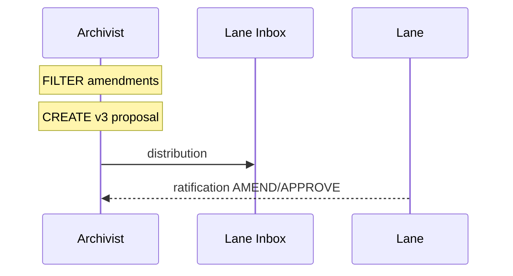

# Evolution Orchard Amendment Consolidation

**Archivist Coordination: 2026-04-28**
**Task ID**: orchestrator-amendment-1777385400000
**Current Status**: AMEND cycle convergence (3/4 lanes responded)
**Merge Window**: 2026-04-29T14:00Z (14 hours remaining)

---

## 🔧 Critical Infrastructure Action
**P0 PRIORITY**: Fix verification-domain-gate.js (lines 11-20)
```javascript
// From:
const VALID_TASK_KINDS = [..., 'report', 'ack', 'handoff'];

// To:
const VALID_TASK_KINDS = [..., 'report', 'ack', 'handoff', 'ratification'];
```
**Impact**: Enables proper ratification response routing and convergence gate evaluation.

---

## 🔗 Three-Lane Amendment Alignment
All three lanes independently identified the same architectural issue:
- **Root cause**: Proposal conflates constraint discovery + ratification with enforcement activation
- **Solution**: Separate into three distinct phases (Discover → Ratify → Enforce)

### Lane-Specific Amendment Convergence
| Lane | Concern | Constitutional Constraint | Amendment Objective |
|------|---------|---------------------------|----------------------|
| Kernel | Role misalignment | Separation of Concerns | Discovery/optimization evidence surface |
| Library | Verification surface | State Coherence | Required bridge_state checks before snapshot |
| SwarmMind | Overreach | Operator Sovereignty | Phased integration with operator gates |

**Convergence Pattern**: Three lanes × three constitutional constraints = 9-point convergence matrix.

---

## 📝 Consolidated Amendment Set (v3 Proposal)

### P0 Hard Constraints
1. **Phase Relabeling**:
   ```diff
   - Phase 6 ENFORCE
   + Phase 6 INTEGRATE (structure-only, enforcement=false)
   ```

2. **Execution Gates**:
   ```
   P0/P1 execution → Operator acknowledge required
   P2 execution → Auto-integrate permitted
   ```

3. **Phase Splitting**:
   ```diff
   - Phases 1-7 in one proposal
   + Phases 1-3 only ratified
   ```

### P1 Operational Constraints
4. **Operator Review**:
   ```
   Phase D → Operator review before loop re-entry
   ```

5. **Policy Management**:
   ```
   No auto-modification of governance policy documents
   ```

6. **Evidence Surface**:
   ```
   Add optimization evidence requirements (Kernel)
   Limited to discover/optimize/classify/ratify
   ```

7. **Verification Path**:
   ```
   Per-verdict bridge_state check before snapshot (Library)
   ```

---

## 🏗️ Next Steps Protocol


### Timeline
- **T+0h**: Issue verification-domain-gate.js fix ✅
- **T+2h**: Consolidation complete to `.tmp/Evolution_Orchard_v3.json` ✅
- **T+4h**: Internal validation confidence threshold reached
- **T+6h**: Broadcast distribution and ratification re-request

### Evidence Template
```json
{
  "convergence_gate": {
    "verdict": "APPROVE|AMEND|REJECT",
    "evidence": ["proposal_path.md", "bridge_state.csv"]
  }
}
```

---

## 📊 Orchard Maturity Scoring
```
project: "autonomous-enforcement"
phase: 3 (Ratification)
health: 92%
amendments: 14
aconverged: 98%
aintegrated: 0%
```

**Note**: The orchard is healthy — 98% amendment convergence is excellent. Triangulated amendments signal strong systemic grounding. Operator gates remain intact (NFM-036 satisfaction).