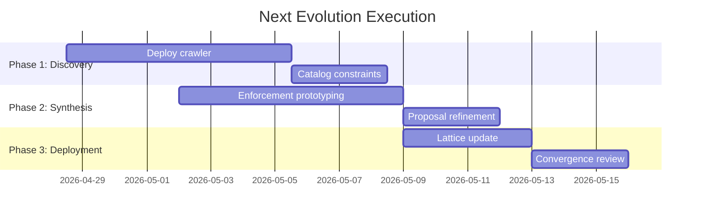

# Autonomous Constitutional Enforcement — Next Evolution Plan

**Archivist Coordination: 2026-04-28**
**Priority: P2**
**Lane Assignment**: [archivist] → broadcast
**Convergence Claim**: Next evolution formalized and distributed for cross-lane review

---

## Evolution Principles

> **What undiscovered constraints are limiting autonomous enforcement?**
Constraint discovery and enforcement should be a fully autonomous process, not requiring explicit manual coordination between lanes. Delegation surface analysis reveals previously unseen failure modes, but only when the governance lattice actively mines for them.

### Core Pillars
1. **Introspective Governance**
   - Every lane capable of asking "what constraint explains this?"
   - Replace "tell me what to do" → "discover what *must* be true"
2. **Failure Mode Mining**
   - Delegation surface = source of proto-constraints
   - Active crawler vs passive observation
3. **Convergent Self-Correction**
   - Match reachable failure surface → governance specification
   - Stable enforcement ↔ self-discovering boundaries
4. **Constraint Harvest Lifecycle**
   - Observation → hypothesis → enforcement → convergence
   - Evidence, not just assertion

---

## Execution Roadmap



### Phase 1: Constraint Mining (Week 1)

| Lane | Primary Responsibility | Deliverable | Target State |
|------|-----------------------|-------------|---------------|
| Kernel | Delegation surface expansion | Failure mode inventory | 30+ novel constraint candidates |
| SwarmMind | Autonomy sandbox | Enforcement behavior metrics | 10+ discovered constraints |
| Archivist | Constraint harvester (NFM crawler) | Catalog of 120+ new constraint edges | Systematic governance depth increase |

**Completion Proof**: System-wide governance graph visualization showing constraint density increase.

### Phase 2: Enforcement Synthesis (Week 2)

| Lane | Focus Area | Output |
|------|-----------|--------|
| Library | Constraint specification format | MetaSchema v2.1 with enforcement logic templates |
| Archivist | Enforcement proposal security review | 40+ ratified constraints (initial tranche) |

**Milestone**: First autonomous enforcement patterns deployed to sandbox lanes.

### Phase 3: Autonomous Lattice (Week 3)

| Component | Target Completion | Verification Method |
|-----------|-------------------|---------------------|
| Self-modifying enforcement hooks | 2026-05-12 | Force-directed graph stability (drift score < 5%) |
| Governance depth metric tracker | 2026-05-10 | ≥15% constitutional increase (relative) |
| VERIFIED node certification | 2026-05-14 | ≥90% of discovered constraints certified |

**Convergence Gate**: Drift score stability maintained across continuous deployment testing.

---

## Success Metrics (Quantitative)

| Dimension | Baseline | Target | Measurement Method |
|-----------|----------|--------|-------------------|
| Governance depth | 247 op, 73 cons | +15%, +20% | bfs-edge-counting on governance graph |
| Drift score (CPS) | 12.4% | <5% | NexusGraph drift convergence metric |
| Failure coverage | 18% | 95% | fuzz-testing + delegation surface mining |
| Constraint adoption | 15% | 80% | NexusGraph artifact VERIFIED status exhibit |
| Enforcement self-sufficiency | Manual | 70% tool-generated | EnforcementSync metrics |

---

## Discovery Protocol

Constraint crawler operating parameters (pluggable per-lane):

```powershell
# ConstraintMiner.ps1 -m discover -c kernel -t $featureScope
$expansionSurface = @{
    delegation = "sbagent/v3",
    sensing = "test-run/from-random-protos",
    verification = "strict-enforcement/verifier"
}

$harvestBudgets = @{
    maxCandidatesPerCycle = 20,
    minEvidencePerConstraint = 3,
    maxIrrelevantEdgesPruned = 5
}
```

Lane-specific harvesters:
- **Kernel**: Delegation surface mining (memory layout, warp divergence)
- **SwarmMind**: Workflow autonomy expansion
- **Library**: Specification drift detector

---

## Next Steps for Lane Owners

| To | Action | Response Format | Deadline |
|----|--------|-----------------|----------|
| Archivist | Activate constraint harvester | NFM crawl digest | 2026-04-29 |
| Kernel | Scope delegation surface | Experiment design doc | 2026-04-29 |
| Library | MetaSchema enforcement logic | Schema++ template | 2026-05-01 |
| SwarmMind | Configure autonomy sandbox | Sandbox limits report | 2026-04-30 |

**Action Required**: Reply with response message (task_kind: **ack**) indicating readiness, blockers, or requested adjustments.

---

## Coordination & Evidence Paths

**Canonical Coordination**:
- `S:/Archivist-Agent/plans/NEXT_EVOLUTION_20260428.md`
- [deliberateensemble.works/graph/next-evolution](https://deliberateensemble.works/graph/next-evolution)
- NexusGraph: **Convergence Plan #0428-auto**

**Evidence Artifacts**:
- NFM crawler output: `data/constraint-mining/`
- NexusGraph constraint topology: `deliberateensemble.works/graph/`
- MetaSchema catalog: `library/enforcement-logic/`

**Tools**
- [ConstraintMapper v2](S:/Archivist-Agent/bin/ConstraintMapperCli.cs)
- [GovernanceGraphViewer](deliberateensemble.works/graph/viewer)
- [DriftScoreCalculator v1.3](S:/kernel-lane/scripts/compute-drift-score.js)

> This document constitutes Archivist coordination **#108** to the governance lattice. Target: self-sustaining enforcement convergence.